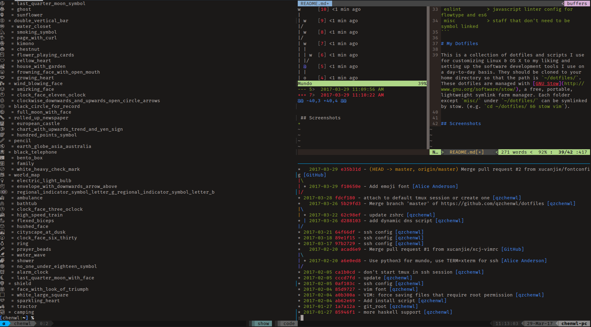

```
      ██            ██     ████ ██  ██
     ░██           ░██    ░██░ ░░  ░██
     ░██  ██████  ██████ ██████ ██ ░██  █████   ██████
  ██████ ██░░░░██░░░██░ ░░░██░ ░██ ░██ ██░░░██ ██░░░░
 ██░░░██░██   ░██  ░██    ░██  ░██ ░██░███████░░█████
░██  ░██░██   ░██  ░██    ░██  ░██ ░██░██░░░░  ░░░░░██
░░██████░░██████   ░░██   ░██  ░██ ███░░██████ ██████
 ░░░░░░  ░░░░░░     ░░    ░░   ░░ ░░░  ░░░░░░ ░░░░░░

  ▓▓▓▓▓▓▓▓▓▓
 ░▓ about  ▓ custom linux config files
 ░▓ author ▓ passer <whzhoua@gmail.com>
 ░▓ code   ▓ https://github.com/icankeep/dotfiles
 ░▓ base   ▓ https://github.com/xero/dotfiles
 ░▓▓▓▓▓▓▓▓▓▓
 ░░░░░░░░░░

 bin            > custom scripts
 fonts          > configs for fira and powerlinesymbols
 git            > global git config and aliases
 ghci           > haskell REPL config
 ssh            > ssh_config
 previews       > screenshots
 tmux           > terminal multiplexer with themes and key bindings
 vim            > IDE like config for vim, enhanced for javascript and haskell
 xmodmap        > make filco minila air more like HHKB
 zsh            > zshell settings, aliases, and custom prompts
 aria2          > configs for download dir and rpc
 deepin         > configs for deepin-terminal
 proxychains    > a proxy for any programs
 nvm            > node version manager
 eslint         > javascript linter config for flowtype and es6
 misc           > staff that don't need to be symbol linked
```

# My Dotfiles

This is a collection of dotfiles and scripts I use for customizing Linux & OS X to my liking and setting up the software development tools I use on a day-to-day basis. They should be cloned to your home directory so that the path is `~/dotfiles/`. These dotfiles are managed with [GNU Stow](http://www.gnu.org/software/stow/), a free, portable, lightweight symlink farm manager. Each folder except `misc/` under `~/dotfiles/` can be symlinked by stow. (e.g. `cd ~/dotfiles/ && stow vim`).


## Screenshots


